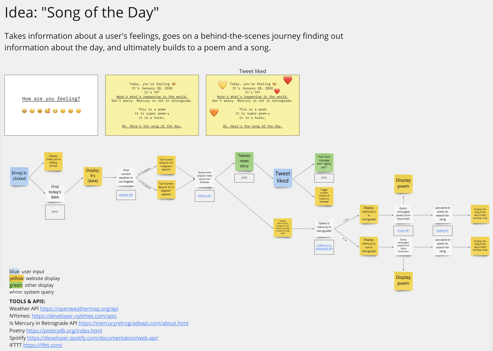
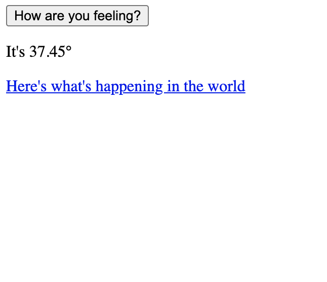
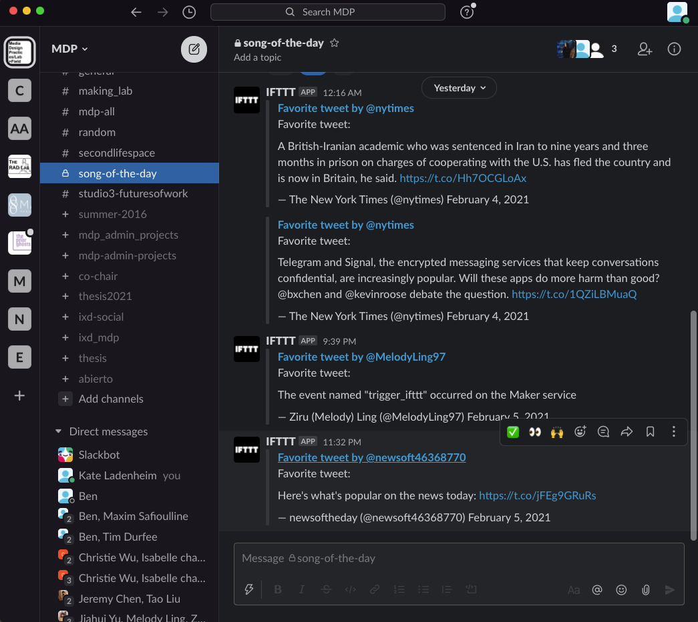

# Week 13
## Project 4
**Gesture to Sound Map**
<iframe src="https://player.vimeo.com/video/538329989?badge=0&amp;autopause=0&amp;player_id=0&amp;app_id=58479" width="800" height="600" frameborder="0" allow="autoplay; fullscreen; picture-in-picture" allowfullscreen title="Gesture Sound Map"></iframe>

## Project 4 Code
<a href="https://github.com/melodyling/CreativeTechSpring2021/tree/gh-pages/gesture-to-sound" target="_blank">Link</a>
 

# Week 12
## Project 3
**Making Space**
<iframe src="https://player.vimeo.com/video/533813067" width="800" height="600" frameborder="0" allow="autoplay; fullscreen" allowfullscreen></iframe>

## Project 3 Documentation
<a href="https://ziruling.cargo.site/Copycat" target="_blank">Link</a>

 

# Week 7

## Reading Response
**Ruined By Design: How Designers Destroyed the World, and What We Can Do to Fix It**

>When all these amazing people, some of whom we don’t understand at all, go online, they are going to behave as inefficiently in there as they do out there. That is awesome.

I found this statement very essential because there is always an ongoing balance between diversity and efficiency, which I found everywhere. Silicon Valley narratives value efficiency really highly by promoting the extent of zero UI - meaning that good design should be seamlessly integrated into lives so that users don't feel it. However, in this trade-off, they also promote a sacrifice on diversity by attempting to make everyone the same. This essentially has a hegemonic narrative that eliminates "queerness" and prolongs the existing dominant positions and stereotypes.

 

>You may be hiring us and that may be your name on the check, but we do not work for you. We’re coming in to solve a problem, because we believe it needs to be solved and it’s worth solving. But we work for the people being affected by that problem. Our job is to look out for them because they’re not in the room. And we will under no circumstances design anything that puts those people at risk.

I think this framing of client relations could be potentially useful in the future describing the essential relation dynamics when forming a contract with clients. Any kind of contract should be based on the prerequisite of a same value system between designers and clients - which is so fundamental but people all tend to ignore that.

 

>People don’t see the things they’re rewarded for as problems to fix.

This is so essential under capitalism... which is inherently a reward system with the use of money, so that nobody feels responsible anymore to fix problems as long as they are rich, or their businesses are profitable.

 

# Week 6

## Reading Response
**Petri Dish**

>Nature and culture contaminate each other. Nature and culture dissolve into each other. We exist through environments that seem to be crumbling as forms of social welfare like education, health care, social security and public works are undercut and privatized.

I agree with this statement. As technology comes to the forefront, our current bio-industry really depends on "an economy of invention instead of an economy of production". Essentially what's behind the dominating narrative of biodesign is a question of "postmodern nature" - is nature designable, and can anything ever be natural anymore? Is every designable products fake, as at the opposition of nature? Just as this statement points out - nature and culture dissolve into each other at an unprecedented scale. 

 

**Design as Machines Come to Life**

>Humanity's needs and consumer desires could be neatly balanced with our planet's limited resources, as our machines come to life.

This statement is really interesting. I've never thought of machines in this angle and it is really fascinating. Machines and AI not only calculate need based on a huge collection of datapoints from mass individuals, but creating needs and desires as well. It seems to me to be a cycle that mutually feeds into each other.

 

>The question whether the ethical burden of the designed object lies with the consumer, designer, manufacturer, or shareholder remains as neglected yet relevant for design as it will be for synthetic biology and the design of living machines.

This is something really worth thinking about because capitalism naturally dis-prioritize ethics, as long as it is profitable. Therefore, within these different social sectors, it is really unsure of where the ethical burdens fall. To me, I saw a trend of designers gradually rising to a place bridging the gap of "what can work" and "what should it be", while finding a balance between grounding in reality and applicability, speculating the future, as well as artistic appeals that tend to influence and shape mass behaviors.

 

## Project 2
**Rate My Setup**
<iframe src="https://player.vimeo.com/video/517447246" width="800" height="600" frameborder="0" allow="autoplay; fullscreen" allowfullscreen></iframe>

 

# Week 5

## Reading Response
**A Brief Visit to the Systems Zoo**

>Just as zoo animals more naturally occur mixed together in ecosystems, so the systems animals described here normally connect and interact with each other and with others not illustrated here — all making up the buzzing, hooting, chirping, changing complexity in which we live.

I think this quote points well to the nature of any systems - they usually are interpretations and maybe simplifications, not actual representations of realities in an unfiltered way. Each model and framework has in itself a perspective from those who made it, and it is important to recognize this. Here, I think to use the zoo as a metaphor is really clever.

 

>A person in the system who makes a decision based on the feedback can’t change the behavior of the system that drove the current feedback; the decisions he or she makes will affect only future behavior.

The latency is always something we ignore when building a system. Just like the processing of machines, economic and social situations often take time to respond as well, and human factors always contain more delay but are often times underestimated. Therefore, I think this sentence is really worth pointing out here.

 

>Dynamic systems studies usually are not designed to predict what will happen. Rather, they’re designed to explore what would happen, if a number of driving factors unfold in a range of different ways.

It is really interesting to view the design of systems in this angle, in that they contain another layer of speculative purpose as a medium for exploration.

 

# Week 4

## Reading Response
**Notes on Failure**

>If despair is - as I believe it to be - as absurd a state of the soul as euphoria, who can protest that it feels more substantial, more reliable, less out of scale with the human environment-? When it was observed to T. S. Eliot that most critics are failed writers, Eliot replied: "But so are most writers."

I simply love the language of Joyce Carol Oates after reading this, in that she explains the process of creation as a form of internal energy in a beautiful way. I love how she compares despair with euphoria as both possessing an excessive amount of energy, and it is this form of energy itself that pushes one to contiue writing and creation. It is almost existential in a way that it speaks so fundamentally towards a naturally ontological state of human beings - that failure is creation itself.

 

>In this, the art of reading hardly differs from the art of writing, in that its most intense pleasures and pains must remain private, and cannot be communicated to others. Our secret affinities remain secret even to ourselves... we fall in love with certain works of art, as we fall in love with certain individuals, for no very clear motive.

After reading this I am really keen on learning more on the critical theory of emotions - how they become a driving force towards one's identity and how it creates interesting tensions towards the opposition / inversion between social relationships. Looks like there's always a tension between the most authentic self and "the others", because we long for the ultimate understanding at the same time when we are fearful of being exposed from privacy. To me, art and writing are always channels for expression to reconcile this contradiction.

 

>This insatiable desire to write something before I die, this ravaging sense of the shortness and feverishness of life, make me cling ... to my one anchor.

I just want to highlight this quote from Virginia Woolf.. so beautifully written.

 

# Week 3

## Reading Response
**You Look Like a Thing and I Love You**

>Sentiment-rating algorithms like this can learn to be biased. The common thread seems to be that if data comes from humans, it will likely have bias in it.

This sentence is really worth highlighting because a current common misperception is that AI is more objective or neutral than human decisions. However, in the end it falls back to the same place because the data from AI all come from human beings, so it is impossible to get rid of biases. What we can do is to acknowledge it as the first step.

 

>People treat these kinds of algorithms as if they are making recommendations, but it’s a lot more accurate to say that they’re making predictions.

I think biased AI algorithms combining with predictions could be potentially a really dangerous thing, if used in important decision-making process. An example of this kind of threat is predictive policing, as the author mentioned. It is harmful in that the whole system reinforces existing human biases, as AI is unconsciously learning from past human biases and mistakes, and build them into its own system. This ends up creating a feedback loop that creates social hierarchies.

 

>The bias is still there, because the AI copied it from its training data, but now it’s wrapped in a layer of hard-to-interpret AI behavior.

Another part of why AI bias is always so hard to overcome is that there is always a blackbox within the huge amount of data and ways of training. Therefore, I also feel like we need to aim for a level of more transparency, and design for a better means of data collection.

 

## Project 1
**The Web as a Rube Goldberg Machine**

This is a collaborative project with Kate Ladenheim and Tao Liu.

<a href="https://kateladenheim.github.io/MDP-CreativeTech/rube-goldberg/rb-start.html" target="_blank">Link</a>

 

## Project 1 Documentation

Idea, interface sketch, technical flow chart, & APIs
 

Web interface test of weather (Open Weather Map) & news (NY Times)
 

IFTTT test (web hook -> Twitter -> Slack)
 

 

## Project 1 Code
<a href="https://github.com/melodyling/CreativeTechSpring2021/tree/gh-pages/rube-goldberg/code" target="_blank">Link</a>

 

## Project 1 Reflection

This is an interesting project to me as it's the first time I see the web having the ability to create something more aesthetic/mechanical/illogical instead of functional, and I see the beauty within it. At the same time, as internet connects people at their fingertips instantly in an unprecedented way, I find the concept of individual in relation to the larger world worth of more exploration. As we connect world news and weather with individual's emotional journey, I found the individual within a larger context more so than ever in that there's a subtle relation between them that is situational, even in a chaotic way that doesn't make sense.

 

# Week 2

## Reading Response
**Programming Design Systems**

>There is a century-long bond between the field of design and new advances in technology, and if graphic designers do not become fluent in this new digital reality, they will become irrelevant.

I found this statement interesting as it speaks to designers' presumed responsibility adapting to new technologies and tools as a way of "staying relevant". Indeed, the languages of graphic design and other forms inevitably evolve with the emergence of new media and different affordances, and how people access content become different. However, I feel like designers should also not take a passive standpoint adapting to new digital realities whenever something new come out, but actively influence the emergences of these new media as intentional design choices as well.  

 

>Design systems are especially interesting today, because digital products are systems, and designers who code are no longer confined to the creation of design systems that end up in printed manuals.

It's interesting to see how digital products are inherently related to systems. As codes have logics and systems of their own, it is an excellent way to use the thinking in coding and apply it to the design of systems. To me, this kind of systematic thinking in code potentially pushes the movement of designing in systems as well. The emergence of digitized design systems, and coding systems such as p5 used in graphic languages are great examples.  

 

>Meta-design is much more difficult than design; it is easier to draw something than to explain how to draw it. […] However, once we have successfully explained how to draw something in a sufficiently general manner, the same explanation will work for related shapes, in different circumstances; so the time spent in formulating a precise explanation turns out to be worth it.

I just want to re-quote this one - the logic of designing a system of logic behind a thing is so much harder than designing a thing itself. However, it speaks largely to the resulting efficiency and seamless workflow that it turns out. In the age of mass production, this movement seems to be self-justifiable on its own.  

 

## Project Proposal & System Diagram
**The Web as a Rube Goldberg Machine**

<a href="https://miro.com/app/board/o9J_lXZSoVM=/" target="_blank">Link to Board</a>

 

